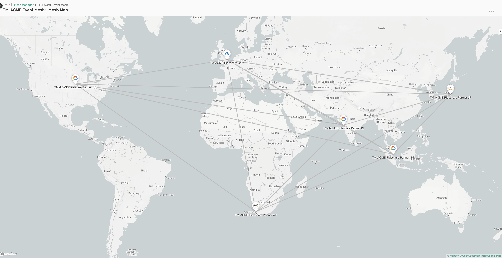

# Set up a Demo Environment for SE Activities

This set of scripts helps you to set up and tear down an Event Mesh for your demos.

There's also scripts to configure each services and will generate some fake load on the mesh to demo PubSub+ Insight





# Prerequisites

 Solace Cloud Environment with an API Token   
 These scripts require an unix like environment and PHP cli.

* on linux 

  `sudo apt-get install -y php-cli`
* on MacOsX 

  `brew install php`


This scripts has been tested with PHP 8 : 
```
php --version
PHP 8.1.9 (cli) (built: Aug  4 2022 15:11:08) (NTS)
Copyright (c) The PHP Group
Zend Engine v4.1.9, Copyright (c) Zend Technologies
with Zend OPcache v8.1.9, Copyright (c), by Zend Technologies
```

# Set up Demo

## Get an API Token from Solace Cloud

Follow the instructions here :
https://docs.solace.com/Cloud/ght_api_tokens.htm#Create

Minimum required rights 

=== My Services ===
 - Get My Services with Management Credentials
 - Create Services
 - Delete My Services

=== Cloud Services === 

 - Get Datacenters

=== Mesh Manager ===
 - Mesh Manager Read
 - Mesh Manager Write


Copy the token and put it in the following file : 

```
mkdir -p ~/.cred/
chmod 700 ~/.cred/ 
vi ~/.cred/SolaceCloudToken.txt
```
and paste the token in that file.
No "new line" (\n) at the beginning or the end of the file.

## Configuration

Edit the configDemoEnv.php
In this file, you'll need to provide : 
 * API Host
 * API Token (it's advised to keep this in an external file to not commit the token which is a secret)
 * A list of service name and their datacenters 
   * you can also customize the type, class, and version, see ServiceConfig.php for constructor documentation
   * By default, it creates Enterprise 250 services in version 10.0
 * Event Mesh Name

To get the list of available DataCenterID, run the following script : 
```
./datacCenterList.php
```
(or create a service in the desired location with Solace Cloud and spy the REST Call with the developer tools)

Here is a full example of the configuration :
```
$servicesConfig = new ServicesConfig(
    "https://api.solace.cloud",
    rtrim(file_get_contents( $_SERVER['HOME']."/.cred/SolaceCloudToken.txt"), "\n"),
    [
        new ServiceConfig("ACME Rideshare Core"      , "aks-uksouth"          ),
        new ServiceConfig("ACME Rideshare Partner AF", "eks-af-south-1b"      ),
        new ServiceConfig("ACME Rideshare Partner US", "gke-gcp-us-central1-a"),
        new ServiceConfig("ACME Rideshare Partner JP", "eks-ap-northeast-1a"  )
    ],
    'ACME Event Mesh');
```

Check that your setup is correct in terms of connectivity by calling 

```
./datacCenterList.php
```

## Set up the Environment

This will create all services, wait for their creation to be completed, and then create the Mesh.

```
./1.createDemoEnvironment.php
```

## Tear down the Environment

This will delete the Mesh, wait for its deletion to be completed, and then delete the services.
```
./2.deleteDemoEnvironment.php
```


# Configure Broker


